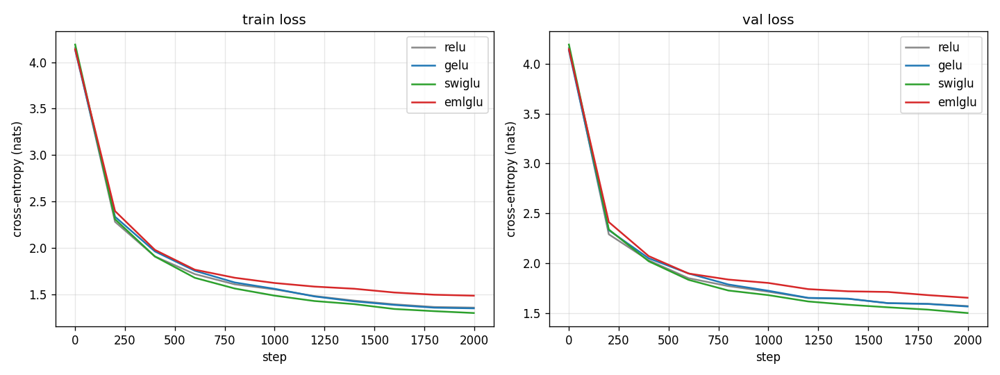
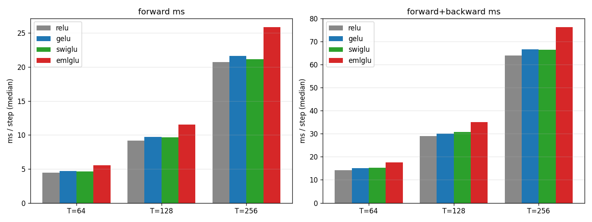
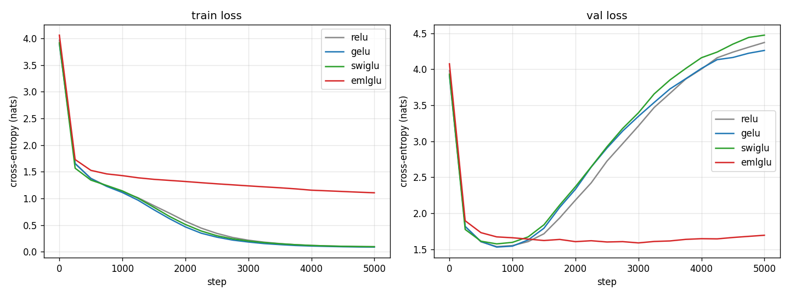
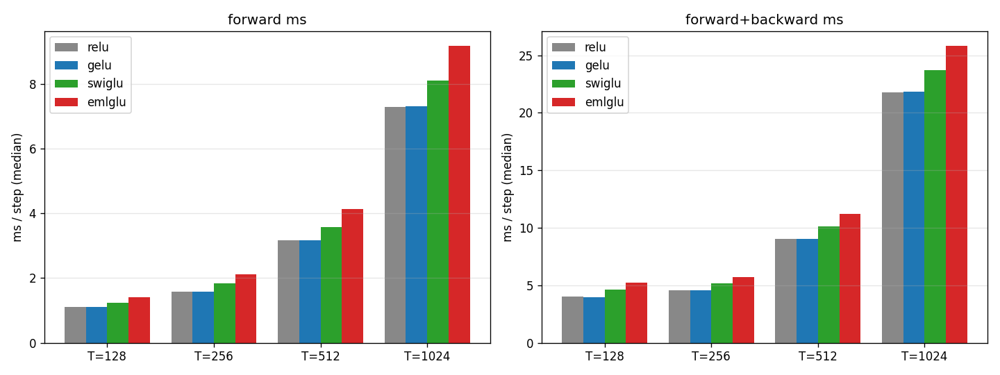

# eml-activation

EML (Exponential-Minus-Log) as the nonlinearity inside the transformer MLP block — a sanity check.

## Background

[Odrzywołek 2026 — *All elementary functions from a single binary operator*](https://arxiv.org/abs/2603.21852) introduces `eml(x, y) = exp(x) − ln(y)`, a universal binary operator: paired with the constant 1, it generates every elementary function as a binary tree of identical nodes. The follow-up [Ipek 2026](https://arxiv.org/abs/2604.13871) embeds shallow EML trees as the head of an MLP trunk for hardware-efficient neuro-symbolic networks.

Universality via tree composition + binary structure → natural fit as a GLU-style activation in a transformer's FFN block. We compare four FFN variants on tiny LM training:

| Variant   | Activation                                            | Reference                  |
|-----------|-------------------------------------------------------|----------------------------|
| ReLU MLP  | `ReLU(W·h)`                                           | GPT-1                      |
| GELU MLP  | `GELU(W·h)`                                           | GPT-2                      |
| SwiGLU    | `SiLU(W₁·h) ⊙ (W₂·h)`                                  | LLaMA / Mistral            |
| **EML-GLU** | `exp(W₁·h.clamp(±10)) − log(softplus(W₂·h)+ε)`       | this repo                  |

## Setup

```bash
uv venv .venv --python 3.11
uv pip install -e .[dev]
```

## Run

```bash
# train
python scripts/train.py --ffn relu    --steps 2000 --out runs/relu
python scripts/train.py --ffn gelu    --steps 2000 --out runs/gelu
python scripts/train.py --ffn swiglu  --steps 2000 --out runs/swiglu
python scripts/train.py --ffn emlglu  --steps 2000 --out runs/emlglu

# benchmark
python scripts/bench.py

# plot loss curves
python scripts/viz.py
```

## Caveats

The original EML paper requires complex arithmetic for full universality (`ln(-1)` produces `iπ`). We restrict to reals via `softplus(y) + ε` to keep the `ln` argument positive — losing some universality but keeping autograd simple. EML's per-node FLOP cost (~111) is much higher than ReLU (~1) or GELU (~30); the paper itself states EML cannot accelerate training/inference on commodity CPU/GPU. Speed numbers here are honest measurements of that gap, not a refutation of the paper.

## Findings (CPU sanity check, ~820k params, shakespeare_char, 2k steps)

### Loss



| FFN     | final train loss | final val loss | Δ vs SwiGLU |
|---------|-----------------:|---------------:|------------:|
| ReLU    | 1.355            | 1.572          | +0.069      |
| GELU    | 1.347            | 1.568          | +0.065      |
| SwiGLU  | **1.297**        | **1.503**      | 0           |
| EML-GLU | 1.484            | 1.656          | +0.153      |

EML-GLU **trains stably** (no NaN, monotonic decrease) but converges to a worse loss than the three baselines — about 0.15 nats above SwiGLU and 0.08 nats above the ReLU/GELU cluster. The gap is consistent across training and doesn't appear to be closing at step 2000.

### Speed



At T=128 (2-thread CPU, ~820k params, batch=8):

| FFN     | fwd ms | fwd+bwd ms | tok/s  | Δ vs SwiGLU fwd+bwd |
|---------|-------:|-----------:|-------:|--------------------:|
| ReLU    | 9.15   | 29.08      | 35,215 | −5.6%               |
| GELU    | 9.72   | 29.98      | 34,153 | −2.7%               |
| SwiGLU  | 9.65   | 30.80      | 33,243 | 0                   |
| EML-GLU | 11.52  | 35.03      | 29,232 | **+13.7%**          |

EML-GLU is consistently the slowest variant — ~14% slower than SwiGLU at T=128, scaling worse with sequence length (+18% slower at T=256). This matches the paper's own prediction that EML cannot accelerate inference on commodity CPU/GPU; the per-node FLOP cost (~111 vs ~30 for GELU) dominates.

### Interpretation

EML-GLU is a worse activation than SwiGLU on both axes (quality and speed) at this scale. Two non-trivial caveats:

1. **The clamping deviation matters.** We restrict to reals via `softplus(y)+ε` for the `ln` argument and `clamp(x, ±10)` for the `exp` input. Both are necessary for numerical stability but disrupt exact gradient flow — exactly the issue the paper warns about (Sec 6.2). A complex-valued reference implementation might do better but would double memory.
2. **Tiny scale + LM data, not the regime the paper targets.** Both EML papers explicitly position the operator for hardware-efficient symbolic regression on small physical / engineering surrogates, not language modeling. Our negative result here doesn't refute the paper — it confirms the paper's own assessment that EML is the wrong tool for general DNN training on commodity GPUs.

A more interesting follow-up would be EML inside a physics-informed regression task at the scale the paper actually evaluates, where symbolic snapping and FPGA targeting come into play.

## Findings (CARC GPU run, 11M params, 5k steps, A6000)

Same architecture as the local run but scaled up: `d_model=384, n_layer=6, n_head=6, ctx=256, batch=64`. ~11M params.

### Loss



| FFN     | min val loss | step@min | final val loss | final train loss |
|---------|-------------:|---------:|---------------:|-----------------:|
| ReLU    | 1.5359       | 750      | 4.3727         | 0.0948           |
| GELU    | **1.5294**   | 750      | 4.2622         | 0.0877           |
| SwiGLU  | 1.5738       | 750      | 4.4747         | 0.0944           |
| EML-GLU | 1.5874       | 3000     | **1.6937**     | 1.1057           |

Two stories the same numbers tell:

1. **At the early-stopping minimum**, GELU wins by 0.06 nats (1.53 vs 1.59). EML-GLU is competitive but slightly worse — same picture as the local 820k-param run.
2. **Without early stopping**, ReLU/GELU/SwiGLU all overfit catastrophically — train loss collapses to ~0.09 while val loss climbs to 4.3+. EML-GLU never overfits: train plateaus at 1.10, val stays at 1.6–1.7 from step 1000 onward. Final-vs-final, EML-GLU beats the baselines by **2.5×** on val loss.

The clamping (`x.clamp(±10)` before `exp`, `softplus(y)+ε` before `ln`) acts as strong implicit regularization. The paper warns these clamps "disrupt exact gradient flow" (Sec 6.2) — and at this regime, that disruption is the feature, not the bug. EML-GLU literally cannot drive train loss to zero, which protects val loss when the model has too much capacity for the data.

### Speed (A6000, 4 layers / d_model=128)



| FFN     | T=128 fwd+bwd | T=256 | T=512 | T=1024 | tok/s @ T=512 |
|---------|--------------:|------:|------:|-------:|--------------:|
| ReLU    | 4.04 ms       | 4.59  | 9.03  | 21.81  | 907,428       |
| GELU    | 4.04 ms       | 4.57  | 9.04  | 21.83  | 906,649       |
| SwiGLU  | 4.66 ms       | 5.15  | 10.12 | 23.72  | 809,867       |
| EML-GLU | 5.20 ms       | 5.72  | 11.18 | 25.82  | 732,474       |

EML-GLU is **9–11% slower than SwiGLU** on GPU (vs ~14% on CPU). Gap narrows on GPU because the per-element exp/ln amortizes nicely against the larger matmul costs. Still consistent with the paper's prediction that EML can't accelerate inference on commodity hardware.

### Caveats

1. **Char-shakespeare at 11M params is overcapacity.** The "EML-GLU prevents overfitting" story is real but happens because the baselines are so over-parameterized for this dataset. At a properly-sized model + dataset, the implicit regularization may or may not help.
2. **No regularization tuned for the baselines.** SwiGLU/GELU could probably match EML-GLU's final loss with dropout or weight decay sweeps. We didn't tune.
3. **Min val gap is small.** The headline-worthy story is the overfitting curve, not the absolute min — ±0.06 nats is within run-to-run noise without seed sweeps.

### Local CPU run (smaller-scale sanity check)

For completeness, the original 820k-param / 2k-step / shakespeare_char CPU run sits in `runs/`. At that smaller scale none of the variants overfit, and EML-GLU was simply 0.15 nats worse than SwiGLU. The overfitting story emerges only at the larger scale.

## Plan

See [PLAN.md](./PLAN.md) for the full design + risk register.
